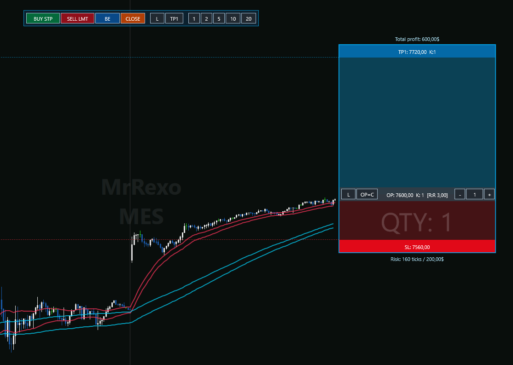
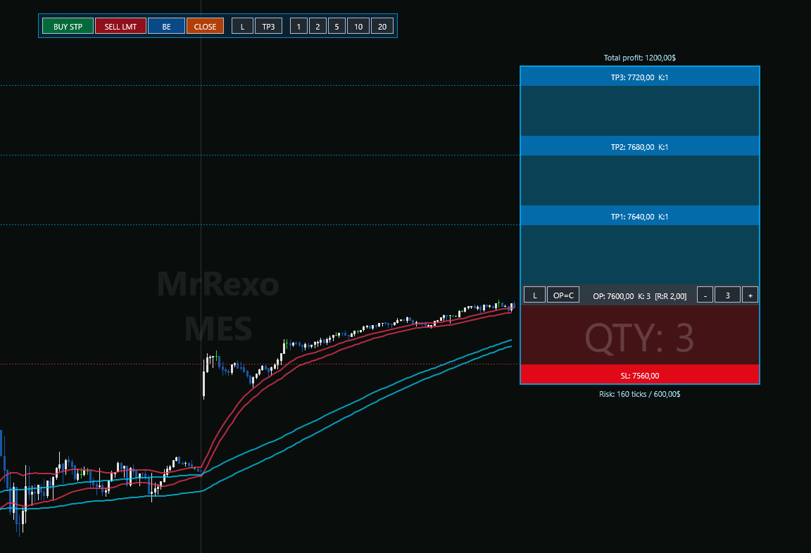
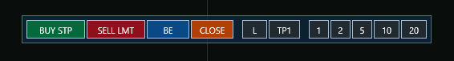

# MrRexoRR-NT8


Interactive risk/reward and bracket order panel for NinjaTrader 8.

MrRexoRR is a NinjaTrader 8 Drawing Tool designed for futures traders who want a fast, chart-first workflow for planning entries, stops, targets, position size, and optional bracket execution.

> This project is trading software. It is not financial advice. Futures trading involves substantial risk of loss. Test on Playback or a non-live environment before using any order submission features.

## As-Is Software

MrRexoRR is open-source software provided **as is**, without warranty of any kind.

You can inspect, audit, modify, and extend the source code before using it. By using this software, you accept full responsibility for your NinjaTrader installation, workspace, account selection, market data, broker behavior, order submission, trade management, and trading results.

If you do not understand the code or do not accept these terms, do not use the software for order submission.

## Status

MrRexoRR is currently a community/free version under active development.

The current NinjaScript tool includes:

- draggable OP/entry, SL, and TP levels directly on the chart,
- 1TP, 2TP, and 3TP layouts,
- automatic intermediate TP distribution,
- live risk/reward and PnL estimates,
- contract presets and quantity controls,
- long/short switching,
- Shift snap for OP/SL/TP,
- optional bracket order submission,
- OCO protection pairs after entry fill,
- BE button with configurable tick buffer,
- CLOSE button for the current chart instrument,
- PL/EN/DE panel labels,
- Chart Trader account detection with optional account override.

## Screenshots

Screenshots should be captured from Playback or a non-live environment and must not expose account numbers, balances, broker identifiers, or personal information.







## Requirements

- NinjaTrader 8 Desktop
- Windows
- A chart with Chart Trader enabled for order submission workflows
- Market data or Playback connection for order testing

## Installation

See [Installation](docs/installation.md).

Short version:

1. Copy `NinjaScript/DrawingTools/MrRexoRR.cs` into:

   ```text
   Documents\NinjaTrader 8\bin\Custom\DrawingTools
   ```

2. Open NinjaTrader 8.
3. Open `New > NinjaScript Editor`.
4. Compile NinjaScript.
5. Add `MrRexo Panel` from the chart drawing tools menu.

## Order Submission Safety

Order submission is available in the tool, but it should be treated as an advanced feature.

Important behavior:

- The panel uses the account selected in Chart Trader by default.
- `Account override` can be used to force a specific account name.
- Entry orders are submitted from the panel's OP level.
- SL and TP orders are submitted only after the entry order is filled.
- Multi-TP mode creates separate OCO pairs for each target slice.
- `CLOSE` uses account flattening for the chart instrument.
- `BE` moves active protective stop orders to average entry plus/minus the configured buffer.

Read [Trading Risk Disclaimer](DISCLAIMER.md) before using order functionality.

## Repository Layout

```text
NinjaScript/DrawingTools/MrRexoRR.cs   NinjaTrader 8 Drawing Tool
src/MpRiskReward.Core/                 Standalone calculation core experiments
tests/MpRiskReward.Core.Tests/         Lightweight core tests
docs/                                  Installation, usage, notes, roadmap
```

## Documentation

- [Installation](docs/installation.md)
- [Usage](docs/usage.md)
- [Safety Model](docs/safety.md)
- [Roadmap](docs/roadmap.md)
- [Trading Risk Disclaimer](DISCLAIMER.md)
- [Changelog](CHANGELOG.md)

## Free vs Pro Direction

This repository is intended as the Free / Community edition:

- visual risk/reward planning,
- basic bracket execution,
- BE and close actions,
- transparent source code.

Potential Pro features may live separately in the future:

- risk-based position sizing,
- daily loss guards,
- max contracts and max trades limits,
- hotkeys,
- profile presets,
- automated partial management,
- compiled installer and priority support.

## Contributing

Contributions are welcome, but trading-related changes need careful review. See [CONTRIBUTING.md](CONTRIBUTING.md).

## License

MIT License. See [LICENSE](LICENSE).

NinjaTrader is a trademark of its respective owner. This project is independent and is not affiliated with, endorsed by, or sponsored by NinjaTrader.
